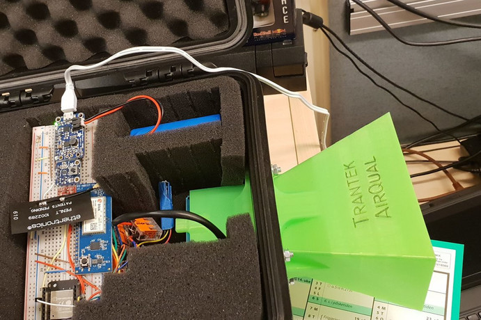

# AirQual aka "Air Quality"

This project was NPRA's attempt to create a custom air quality device running entirely on battery power.
The device needed to updated the measurement every hour (or 30 min) over NB-IoT (Narrowband IoT network) proveded by Telenor.

The air quality measurement device is using the PMS5003 high precision sensor.

## Code

The code for this project is an Arduino sketch file.

_present / describe code here_

## Purpose

We wanted to experiment with some air quality sensors and check whether they gave a "good enough" result in comparison with much more expensive "high end" products.
And also measure both indoor an outdoor air quality. The outdoor air quality is very dependent on the season - winter season has a lot of small dangerous particles due to cars with dudded winter tires.
